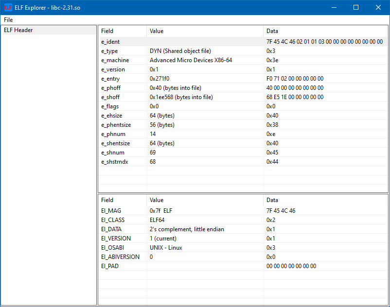

# ELF Explorer

**ELF Explorer** is a Windows GUI application for viewing and analyzing ELF files. It is inspired by PE analysis tools like [CFF Explorer](https://ntcore.com/?page_id=388) and [pestudio](https://www.winitor.com/).

## Installation

Prebuilt releases are available from https://github.com/oshaked1/elf-explorer/releases.

To build from source (requires [Rust](https://www.rust-lang.org/tools/install) to be installed):

```shell
git clone https://github.com/oshaked1/elf-explorer.git
cd elf-explorer
cargo run
```

## Screenshots



## Motivation

This is my first project using the [Rust](https://www.rust-lang.org/) language, so the main motivation for this project is learning the language. I also started this project as a way to learn about the ELF file format. Finally, this is my first time experimenting with Windows' graphical API (and probably the last).